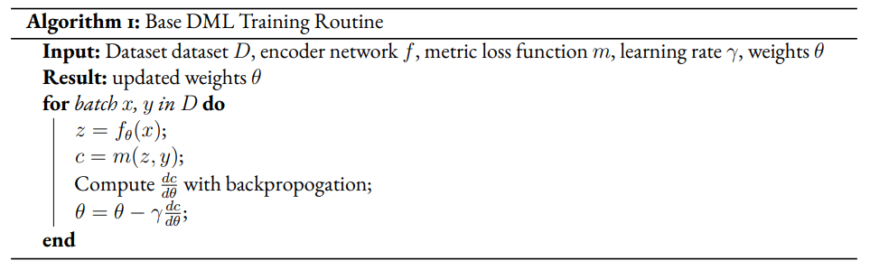
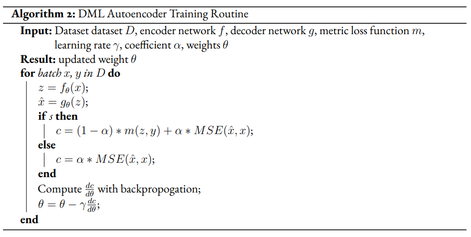
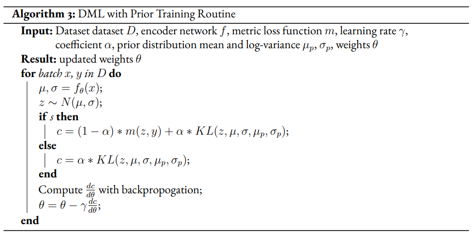
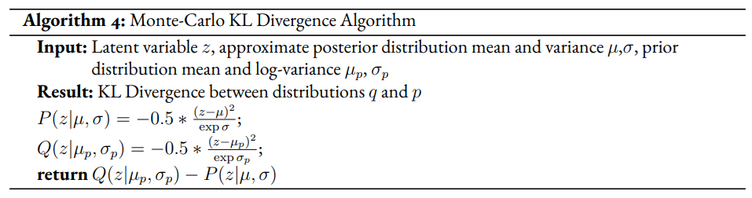
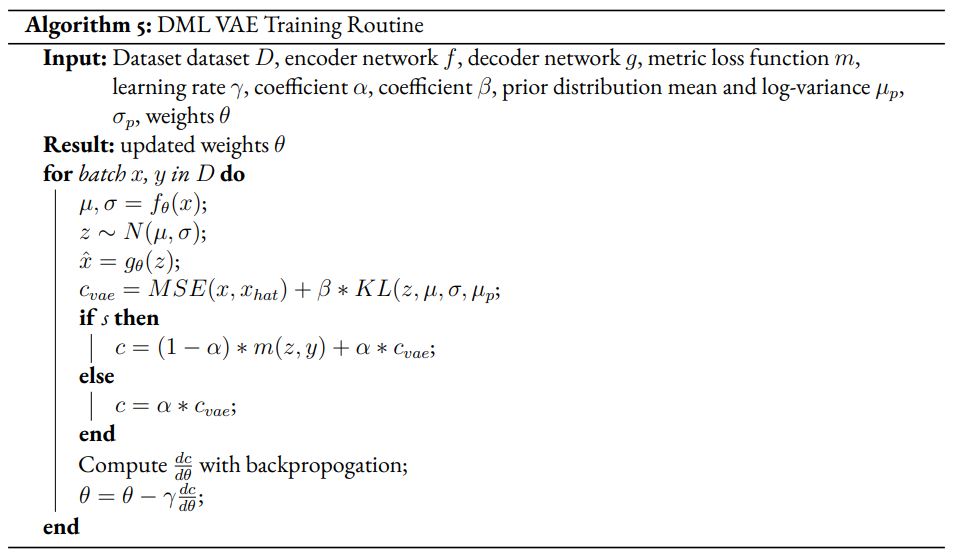
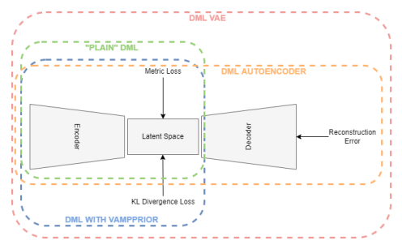
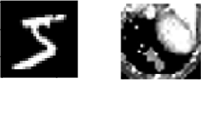

:author: Nathan Safir
:email: nssafir@gmail.com
:institution: Institute for Artificial Intelligence, University of Georgia, Athens, GA 30602 USA

:author: Meekail Zain
:email: meekail.zain@uga.edu
:institution: Department of Computer Science, University of Georgia, Athens, GA 30602 USA

:author: Curtis Godwin
:email: cmgodwin263@gmail.com
:institution: Institute for Artificial Intelligence, University of Georgia, Athens, GA 30602 USA

:author: Eric Miller
:email: EricMiller@uga.edu
:institution: Institute for Artificial Intelligence, University of Georgia, Athens, GA 30602 USA

:author: Bella Humphrey
:email: isabelladhumphrey@gmail.com
:institution: Department of Computer Science, University of Georgia, Athens, GA 30602 USA

:author: Shannon P Quinn
:email: spq@uga.edu
:institution: Department of Computer Science, University of Georgia, Athens, GA 30602 USA
:institution: Department of Cellular Biology, University of Georgia, Athens, GA 30602 USA

:bibliography: ref

------------------------------------------------------------------
Variational Autoencoders For Semi-Supervised Deep Metric Learning
------------------------------------------------------------------

.. class:: abstract

    Deep metric learning (DML) methods generally do not incorporate unlabelled data. We propose
    performing borrowing components of the variational autoencoder (VAE) methodology to extend DML
    methods to train on semi-supervised datasets. We experimentally evaluate atomic benefits to the perform-
    ing DML on the VAE latent space such as the enhanced ability to train using unlabelled data and to induce
    bias given prior knowledge

.. class:: keywords

    Variational Autoencoders, Metric Learning, Deep Learning, Representation
    Learning, Generative Models

Introduction
------------

Within the broader field of representation learning, metric learning is an area which looks to define a
distance metric which is smaller between similar objects (such as objects of the same class) and larger
between dissimilar objects. Oftentimes, a map is learned from inputs into a low-dimensional latent space
where euclidean distance exhibits this relationship, encouraged by training said map against a loss (cost)
function based on the euclidean distance between sets of similar and dissimilar objects in the latent space.
Existing metric learning methods are generally unable to learn from unlabelled data, which is problematic
because unlabelled data is often easier to obtain and is potentially informative.

We take inspiration from variational autoencoders (VAEs), a generative representation learning architecture,
for using unlabelled data to create accurate representations. Specifically, we look to evaluate three
atomic claims that detail how pieces of the VAE architecture can create a better deep metric learning
(DML) model on a semi-supervised dataset. From here, we can ascertain which specific qualities of how
VAEs process unlabelled data are most helpful in modifying DML methods to train with semi-supervised
datasets.

First, we propose that the autoencoder structure of the VAE helps the clustering of unlabelled points,
as the reconstruction loss may help incorporate semantic information from unlabelled sources. Second,
we claim that the structure of the VAE latent space, as it is confined by a prior distribution, can be used
to induce bias in the latent space of a DML system. For instance, if we know a dataset contains N -many
classes, creating a prior distribution that is a learnable mixture of N gaussians may help produce better
representations. Third, we claim that performing DML on the latent space of the VAE so that the DML
task can be jointly optimized with the VAE to incorporate unlabelled data may help produce better repre-
sentations.

Each of the three claims will be evaluated experimentally. The claims will be evaluated by comparing
a standard DML implementation to the same DML implementation:

* jointly optimized with an autoencoder
* while structuring the latent space around a prior distribution using the VAE’s KL-divergence loss term between the approximated posterior and prior
* jointly optimized with a VAE

Our primary contribution is evaluating these three claims. Our secondary contribution is presenting
the results of the joint approaches for VAEs and DML for more recent metric losses that have not been
jointly optimized with a VAE in previous literature.

Related Literature
----------------------
The goal of this research is to investigate how components of the
variational autoencoder can help the performance of deep metric learning
in semi supervised tasks. We draw on previous literature to find not
only prior attempts at this specific research goal but also work in
adjacent research questions that proves insightful. In this review of
the literature, we discuss previous related work in the areas of
Semi-Supervised Metric Learning, Semi-supervised VAEs, and VAEs with
Metric Losses.

Semi-Supervised Metric Learning
++++++++++++++++++++++++++++++++

There have been previous approaches to designing metric learning
architectures which incorporate unlabelled data into the metric
learning training regimen for semi-supervised datasets. One of the
original approaches is the MPCK-MEANS algorithm proposed by Bilenko et
al. (:cite:`bilenko2004integrating`), which adds a
penalty for placing labelled inputs in the same cluster which are of a
different class or in different clusters if they are of the same
class. This penalty is proportional to the metric distance between the
pair of inputs. Baghshah and Shouraki
(:cite:`baghshah2009semi`) also looks to impose
similar constraints by introducing a loss term to preserve locally
linear relationships between labelled and unlabelled data in the input
space. Wang et al. (:cite:`wang2013semi`) also use a
regularizer term to preserve the topology of the input space. Using
VAEs, in a sense, draws on this theme: though there is not explicit
term to enforce that the topology of the input space is preserved, a
topology of the inputs is intended to be learned through a
low-dimensional manifold in the latent space.

One more recent common general approach to this problem is to use the
unlabelled data’s proximity to the labelled data to estimate labels
for unlabelled data, effectively transforming unlabelled data into
labelled data. Dutta et al. (:cite:`dutta2021semi`)
propose a model which uses affinity propagation on a
k-Nearest-Neighbors graph to label partitions of unlabelled data based
on their closest neighbors in the latent space. Wu et al.
(:cite:`wu2020metric`) also look to assign
pseudo-labels to unlabelled data, but not through a graph-based
approach. Instead, the proposed model looks to approximate "soft"
pseudo-labels for unlabelled data from the metric learning similarity
measure between the embedding of unlabelled data and the center of
each input of each class of the labelled data.

Semi-supervised VAEs
+++++++++++++++++++++

There have been previous attempts at incorporating labelled
information into the VAE framework. As discussed before, the VAE
training regimen does not incorporate training labels – creating a
training regimen for the VAE which does learn from labels is not
straightforward. An early solution proposed to this problem are Kingma
and Welling’s proposed M1 and M2 models
(:cite:`kingma2014autoencoding`). The M1 model trains
the VAE on data :math:`X` without the labels :math:`Y` to produce
encodings :math:`Z` and then trains a separate model on a supervised
task with the data and labels pair :math:`(Z, Y)`. The M1 model does
not actually train the underlying VAE differently, so the authors
propose an M2 model, which differs from the vanilla VAE in that there
are two encoders which produce not only the latent vector :math:`z`
for each datapoint :math:`x` but also a predicted label :math:`y'`,
both of which the decoder receives as input. The classification task
(i.e. the encoder’s prediction :math:`y'`) is trained jointly with the
regular VAE loss, as is consistent with the authors’ new derivation of
the VAE ELBO.

A more recent approach to the semi-supervised VAEs discourages
producing an explicit label embedding within the latent space. Joy et
al. (:cite:`joy2020capturing`) propose a model which
encodes several latent vectors :math:`z_{1}, z_{2}, ... z_{n}` for
:math:`n` labelled characteristics of the image. For instance, if the
dataset was over pictures of people, one characteristic may be if the
person was smiling, if they were blonde, etc. For each characteristic
:math:`c_{i}`, a classifier is trained to predict :math:`y_{i}` from
only the latent vector :math:`z_{i}`. The authors argue that this is a
superior training approach than creating explicit label embeddings
with an encoder network as binary labels such as "smiling/not smiling"
are oftentimes not actually binary (ex. a picture may show the subject
slightly smiling or greatly smiling)

VAEs with Metric Loss
++++++++++++++++++++++
Some approaches to incorporating labelled data into VAEs use a metric
loss to govern the latent space more explicitly. Lin et al.
(:cite:`lin2018deep`) model the intra-class invariance
(i.e. the class-related information of a data point) and intra-class
variance (i.e. the distinct features of a data point not unique to
it’s class) seperately. Like several other models in this section,
this paper’s proposed model incorporates a metric loss term for the
latent vectors representing intra-class invariance and the latent
vectors representing both intra-class invariance and intra-class
variance.

Kulkarni et al. (:cite:`kulkarni2020deep`) incorporate
labelled information into the VAE methodology in two ways. First, a
modified architecture called the CVAE is used in which the encoder and
generator of the VAE is not only conditioned on the input :math:`X`
and latent vector :math:`z`, respectively, but also on the label
:math:`Y`. The CVAE was introduced in previous papers
(:cite:`sohn2015learning`)
(:cite:`dahmani2019conditional`). Second, the authors add
a metric loss, specifically a multi-class N-pair loss
(:cite:`sohn2016improved`), in the overall loss function
of the model. While it is unclear how the CVAE technique would be
adapted in a semi-supervised setting, as there is not a label
:math:`Y` associated with each datapoint :math:`X`, we also experiment
with adding a (different) metric loss to the overall VAE loss
function.

Most recently, Grosnit et al.
(:cite:`grosnit2021high`) leverage a new training
algorithm for combining VAEs and DML for Bayesian Optimization and
said algorithm using simple, contrastive, and triplet metric losses.
We look to build on this literature by also testing a combined VAE DML
architecture on more recent metric losses, albeit using a simpler
training regimen.

Lastly, though the paper does not discuss VAEs, it is worthwhile to
note Andresini et al.’s (:cite:`ANDRESINI2021706`)
combined approach to metric learning (specifically triplet loss) and
autoencoders. For a dataset with two classes, two autoencoders are
trained on only one class, so triplets can be formed using an anchor
point sampled from the dataset, the reconstruction of the autoencoder
for the positive class, and the autoencoder for the triplet of the
negative class. The authors claim that this method, along with other
benefits, do not suffer the convergence problems of many triplet loss
DML architectures as the triplets are not randomly sampled.

Preliminaries
--------------

Deep Metric Learning (DML)
++++++++++++++++++++++++++++
Metric learning attempts to create representations for data by
training against the similarity or dissimilarity of samples. In a more
technical sense, there are two notable functions in DML systems.
Function :math:`f_{\theta}` is a neural network which maps the input
data :math:`X` to the latent points :math:`Z` (i.e.
:math:`f_{\theta}: X \mapsto Z`, where :math:`\theta` is the network
parameters). Generally, :math:`Z` exists in a space of much lower
dimensionality than :math:`X` (eg. :math:`X` is a set of
:math:`28 \times 28` pixel pictures such that
:math:`X \subset \mathbb{R}^{28 \times 28}` and
:math:`Z \subset \mathbb{R}^{10}`).

The function
:math:`D_{f_{\theta}}(x, y) = D(f_{\theta}(x), f_{\theta}(y))`
represents the distance between two inputs :math:`x, y \in X`. To
create a useful embedding model :math:`f_{\theta}`, we would like for
:math:`f_{\theta}` to produce large values of
:math:`D_{f_{\theta}}(x, y)` when :math:`x` and :math:`y` are
dissimilar and for :math:`f_{\theta}` to produce small values of
:math:`D_{f_{\theta}}(x, y)` when :math:`x` and :math:`y` are similar.
In some cases, dissimilarity and similarity can refer to when inputs
are of different and the same classes, respectively.

It is common for the Euclidean metric (i.e. the :math:`L_{2}` metric) to
be used as a distance function in metric learning. The generalized
:math:`L_p` metric can be defined as follows, where
:math:`z_{0}, z{1} \in \mathbb{R}^{d}`.

.. math::

   D_p(z_{0}, z_{1})= || z_{0} - z_{1} ||_{p} =
               (\sum_{i=1}^d | z_{0_{i}} - z_{1_{i}} |^{p})^{1/p}

If we have chosen :math:`f_{\theta}` (a neural network) and the distance
function :math:`D` (the :math:`L_{2}` metric), the remaining component
to be defined in a metric learning system is the loss function for
training :math:`f`. The following section provides a survey of the
development of and differences between notable training objectives in
metric learning, which for brevity we will refer to as *metric loss
functions* or *metric losses*.

Variational Autoencoders (VAEs)
++++++++++++++++++++++++++++++++

Methodology
------------
We look to discover the potential of applying components of the VAE
methodology to DML systems. We test this through presenting incremental
modifications to the basic DML architecture. Each modified architecture
corresponds to a claim about how a specific part of the VAE training
regime and loss function may be adapted to assist the performance of a
DML method for a semi-supervised dataset.

Claim 1 
+++++++++++++

We first look to evaluate the claim that adding a reconstruction loss
to a DML system can improve the quality of clustering in the latent
representations on a semi-supervised dataset. Reconstruction loss in
and of itself enforces a similar semantic mapping onto the latent
space as a metric loss, but can be computed without labelled data. In
theory, we believe that the added constraint that the latent vector
must be reconstructed to approximate the original output will train
the spatial positioning to reflect semantic information. Following
this reasoning, observations which share similar semantic information,
specifically observations of the same class (even if not labelled as
such), should intuitively be positioned nearby within the latent
space. To test if this intuition occurs in practice, we evaluate if a
DML model with an autoencoder structure and reconstruction loss
(described in further detail below) will perform better than a plain
DML model in terms of clustering quality. This will be especially
evident for semi-supervised datasets in which the amount of labelled
data is not feasible for solely supervised DML.

Given a semi-supervised dataset, we assume a standard DML system will
use only the labelled data and train given a metric loss
:math:`L_{metric}` (see Algorithm 1). Our modified model DML
Autoencoder will extend the DML model’s training regime by adding a
decoder network which takes the latent point :math:`z` as input and
produces an output :math:`\hat{x}`. The loss function is then modified
such that there is a supervised loss :math:`L_{S}` which is identical
to the metric loss :math:`L_{metric}` and an unsupervised loss that is
identical to the reconstruction loss :math:`L_{U}`. Each epoch, the
total loss alternates between the supervised and unsupervised loss,
such :math:`L = (1 - \alpha) L_{S} + \alpha L_{U}` on odd number
epochs and :math:`L = \alpha L_{U}` for even number epochs.
:math:`\alpha` is a hyperparameter which modulates the impact of the
reconstruction loss on total loss for the DML autoencoder. The
software tool used, Pytorch Lightning
(:cite:`Falcon_PyTorch_Lightning_2019`), used to construct
the models restricts not using all parameters in the computation of
the loss for a given epoch; thus we have a semi-supervised stage
consisting of the unsupervised and the supervised loss instead of
solely a supervised stage, as the the supervised loss does not make
use of the parameters in the decoder.

Claim 2 
+++++++++++++

Say we are aware that a dataset has :math:`n` classes. It may be
useful to encourage that there are :math:`n` clusters in the latent
space of a DML model. This can be enforced by using a prior
distribution containing :math:`n` many Gaussians. As we wish to
measure only the affect of inducing bias on the representation without
adding any complexity to the model, the prior distribution will not be
learnable (unlike VAE with VampPrior). By testing whether the classes
of points in the latent space are organized along the prior components
we can test whether bias can be induced using a prior to constrain the
latent space of a DML. By testing whether clustering improves
performance, we can evaluate whether this inductive bias is helpful.

Given a fully supervised dataset, we assume a standard DML system will
use only the labelled data and train given a metric loss
:math:`L_{metric}`. Our modified model will extend the DML system’s
training regime by adding a KL divergence term to the loss which
measures the difference between posterior distributions and a prior
distribution. It should also be noted that, like the VAE encoder, we
will map the input not to a latent point but to a latent distribution.
The latent point is stochastically sampled from the latent
distribution during training. Mapping the input to a distribution
instead of a point will allow us to calculate the KL divergence.

The loss function is then modified such that the total loss :math:`L`
is equal to a weighted sum between the metric loss term
:math:`L_{metric}` and the KL divergence term :math:`L_{KL}`. As is
true in the previous section, the total loss alternates between the
supervised and unsupervised loss, such
:math:`L = (1 - \alpha) L_{S} + \alpha L_{U}` on odd number epochs and
:math:`L = \alpha L_{U}` for even number epochs.

In practice, we will be evaluating a DML model with a unit prior and a
DML model with a mixture of gaussians (GMM) prior. The latter model
constructs the prior as a mixture of :math:`n` gaussians – each the
vertice of the unit (i.e. each side is 2 units long) hypercube in the
latent space. The logvar of each component is set equal to one.
Constructing the prior in this way is beneficial in that it is ensured
that each component is evenly spaced within the latent space, but is
limiting in that there must be exactly :math:`2^{d}` components in the
GMM prior. Thus, to test, we will test a datset with 10 classes on the
latent space dimensionality of 4, such that there are
:math:`2^{4} = 16` gaussian components in the GMM prior. Though the
number of prior components is greater than the number of classes, the
latent mapping may still exhibit the pattern of classes forming
clusters around the prior components as the extra components may be
made redundant.

The drawback of the decision to set the GMM components’ means to the
coordinates of the unit hypercube’s vertices is that the manifold of the
chosen dataset may not necessarily exist in 4 dimensions. Choosing
gaussian components from a d-dimensional hypersphere in the latent space
:math:`\mathcal{R}^{d}` would solve this issue, but there does not
appear to be a solution for choosing :math:`n` evenly spaced points
spanning :math:`d` dimensions on a :math:`d`-dimensional hypersphere. KL
Divergence is calculated with a monte carlo approximation for the GMM
and analytically with the unit prior.

Claim 3 
+++++++++++++

The third claim we look to evaluate is that given a semi-supervised
dataset, optimizing a DML model jointly with a VAE on the VAE’s latent
space will produce superior clustering than the DML model individually.
The intuition behind this approach is that DML methods can learn from
only supervised data and VAE methods can learn from only unsupervised
data; the proposed methodology will optimize both tasks simultaneously
to learn from both supervised and unsupervised data.

The MetricVAE implementation we create jointly optimizes the VAE task
and DML task on the VAE latent space. Across epochs, the MetricVAE model
alternates between training only the unsupervised task :math:`L_{U}` and
the semi-supervised task :math:`\alpha * L_{U} + (1 - \alpha) * L_{S}`,
like each of the other modified DML models. The actual implementation
belies the pseudocode algorithm slightly as it uses the VAE with
VampPrior model instead of the vanilla VAE.

Results
------------

Each set of experiments shares a similar hyperparameter search space.
Below we describe the hyperparameters that are included in the search
space of each experiment. We also discuss the hardware used and the the
evaluation method.

Experimental Configuration
++++++++++++++++++++++++++++

Learning Rate (lr)
===================

Through informal experimentation, we have found that the learning rate
of 0.001 causes the models to converge consistently. The learning rate
is thus set to 0.001 in each experiment.

Latent Space Dimensionality (lsdim)
====================================

Latent space dimensionality refers to the dimensionality of the vector
output of the encoder of a DML network or the dimensionality of the
posterior distribution of a VAE (also the dimensionality of the latent
space). When the latent space dimensionality is 2, we see the added
benefit of creating plots of the latent representations (though we can
accomplish this through using dimensionality reduction methods like tSNE
for higher dimensionalities as well). Example values for this
hyperparameter used in experiments are 2, 4, and 10.

Alpha
======

Alpha (:math:`\alpha`) is a hyperapameter which refers to the balance
between the unsupervised and supervised losses of some of the modified
DML models. More details about the role of :math:`\alpha` in the model
implementations are discussed in the methodology section of the model.
Potential values for alpha are each between 0 (exclusive) and 1
(inclusive). We do not include 0 in this set as if :math:`\alpha` is set
to 0, the model is equivalent to the fully supervised plain DML model
because the supervised loss would not be included. If :math:`\alpha` is
set to 1, then the model would train on only the unsupervised loss; for
instance if the DML Autoencoder had :math:`\alpha` set to 1, then the
model would be equivalent to an autoencoder.

Partial Labels Percentage (pl%)
=================================

The partial labels percentage hyperparameter refers to the percentage of
the dataset that is labelled and thus the size of the partion of the
dataset that can be used for labelled training. Of course, each of the
datasets we use is fully labelled, so a partially labelled datset can be
trivially constructed by ignoring some of the labels. As the sizes of
the dataset vary, each percentage can refer to a different number of
labelled samples. Values for the partial label percentage we use across
experiments include 0.01, 0.1, 10, and 100 (with each value referring to
the percentage).

Datasets
=========

Two datasets are used for evaluating the models. The first dataset is
MNIST (:cite:`lecun-mnisthandwrittendigit-2010`), a very
popular dataset in machine learning containing greyscale images of
handwritten digits. The second dataset we use is the organ OrganAMNIST
dataset from MedMNIST v2 (:cite:`medmnistv2`). This dataset
contains 2D slices from computed tomography images from the Liver Tumor
Segmentation Benchmark – the labels correspond to the classification of
11 different body organs. The decision to use a second dataset was
motivated because the as the claims are tested over more datasets, the
results supporting the claims become more generalizable. The decision to
use the OrganAMNIST dataset specifically is motivated in part due to the
the Quinn Research Group working on similar tasks for biomedical imaging
(:cite:`Zain2020TowardsAU`). It is also motivated in part
because OrganAMNIST is a more difficult dataset, at least for a the
classfication task, as the leading accuracy for MNIST is .9991
(:cite:`DBLP:journals/corr/abs-2008-10400`) while the
leading accuracy for OrganAMNIST is .951
(:cite:`medmnistv2`). The MNIST and OrganAMNIST datasets are
similar in dimensionality (1 x 28 x 28), number of samples (60,000 and
58,850, respectively) and in that they are both greyscale.

   Sample images from the MNIST (left) and OrganAMNIST of MedMNIST (right) datasets

Hardware
=========

Every experiment discussed was run on the Quinn Research Group’s
Rocinante server, which contains 4 NVIDIA GeForce RTX 2080 Ti GPUs.
Using the Weights and Biases sweep API, we parallelize the experiments
such that four experiments run simletaneously on one GPU each.

Evaluation
===========

We will evaluate the results by running each model on a test partition
of data. We then take the latent points :math:`Z` generated by the model
and the corresponding labels :math:`Y`. Three classifiers (sklearn’s
implementation of RandomForest, MLP, and kNN) each output predicted
labels :math:`\hat{Y}` for the latent points. In most of the charts
shown, however, we only include the kNN classification output due to
space constraints and the lack of meaningful difference between the
output for each classifier. We finally measure the quality of the
predicted labels :math:`\hat{Y}` using the Adjusted Mutual Information
Score (AMI) (:cite:`vinh2010information``) and accuracy
(which is still helpful but is also easier to interpret in some cases).
This scoring metric is common in research that looks to evaluate
clustering performance (:cite:`zhu2021finding`)
(:cite:`emmons2016analysis`). We will be using sklearn’s
implementation of AMI (:cite:`scikit-learn`). The
performance of a classifier on the latent points intuitively can be used
as a measure of quality of clustering. 

Claim 1
+++++++++

Claim 2
+++++++++

Claim 3
+++++++++

Conclusion
------------
